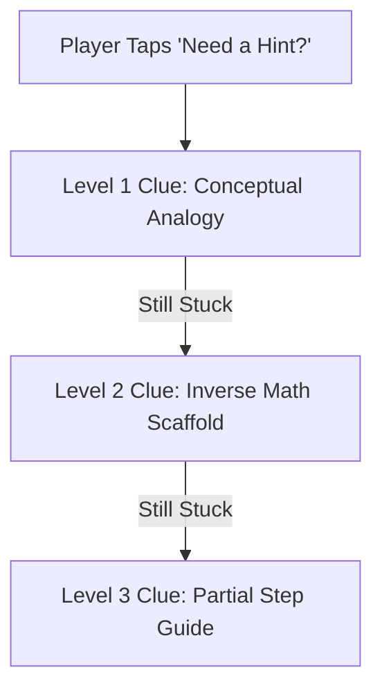
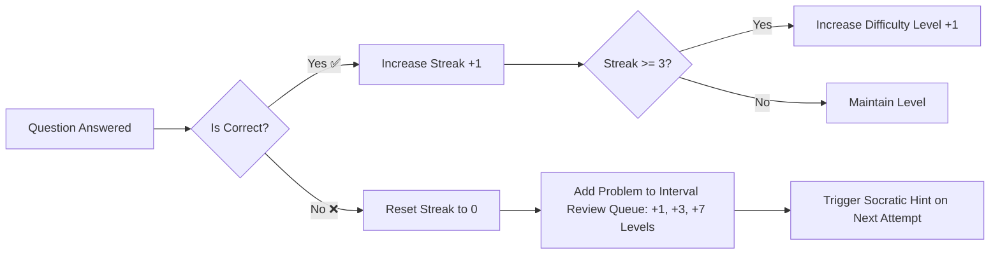

# Phase 5: AI & Pedagogical Tutoring System Research (`AI_PEDAGOGY.md`)

## 1. Executive Overview
This document specifies the pedagogical AI architecture for the mobile math puzzle/arcade game. It covers Socratic hint generation, instant post-error explanations, and a Spaced Repetition / Dynamic Difficulty Adjustment (DDA) algorithm tailored for learners aged 5–15+.

---

## 2. Socratic AI Hint System Architecture

### The Socratic Principle
Rather than revealing the correct answer directly, the AI tutor uses **progressive scaffolding** to guide the student toward independent problem-solving.

### Tiered Clue Framework



| Clue Tier | Pedagogical Strategy | Example for $24 \div 6 = ?$ | Target Response Time |
| :--- | :--- | :--- | :--- |
| **Tier 1 (Nudge)** | Visual & Real-World Metaphor | "Imagine dividing 24 apples evenly into 6 baskets!" | Instant (< 50ms) |
| **Tier 2 (Scaffold)** | Inverse Operation Link | "Think about multiplication: $6 \times \underline{\hspace{0.5cm}} = 24$" | Instant (< 50ms) |
| **Tier 3 (Guided Step)** | Range / Estimation Nudge | "Is the answer bigger than 3 but smaller than 6? Try counting by 6s: 6, 12, 18..." | Instant (< 50ms) |

---

## 3. Instant Post-Error Explanation Engine

Triggered immediately when `Answer == Incorrect ❌`.

### Age-Tailored Explanation System Prompts

```json
{
  "system_prompt_template": "You are a friendly, encouraging math tutor for kids. Provide a 2-sentence explanation of why the correct answer is right. Always connect division back to multiplication.",
  "input": {
    "math_problem": "24 ÷ 6",
    "user_wrong_answer": 6,
    "correct_answer": 4,
    "age_tier": "7-9"
  },
  "generated_explanation": {
    "headline": "❌ Almost! The answer is 4.",
    "breakdown": "24 ÷ 6 = 4 because 6 × 4 = 24.",
    "visual_cue": "If you group 24 items into 6 equal sets, you get 4 in each set!"
  }
}
```

---

## 4. Spaced Repetition & Adaptive Difficulty Algorithm (DDA)

### Mathematical Formulation
The system uses an adapted **Leitner 5-Box Spaced Repetition Model** combined with **Dynamic Difficulty Adjustment (DDA)**.

```
Difficulty Rating (D) = Base_Difficulty * (1 + (Consecutive_Correct * 0.1) - (Consecutive_Incorrect * 0.15))
```



### Review Intervals for Failed Concepts
When a student fails a concept (e.g., *Division by 6*):
1. **Immediate Retry:** Re-introduced 1 level later with a Socratic hint.
2. **Short-Term Review:** Re-introduced 3 levels later in a warm-up round.
3. **Long-Term Mastery:** Re-introduced 7 levels later in a Boss Challenge.

---

## 5. Ready-to-Use AI System Prompts (LLM & Rule Engine)

### Prompt 1: Socratic Hint Generator
```text
SYSTEM PROMPT:
You are SocraticMathBot, an AI tutor for a mobile educational game.
RULES:
1. NEVER reveal the final numerical answer.
2. Give a clue using inverse operations or simple counting analogies.
3. Keep response under 20 words.
4. Use age-appropriate, encouraging language with friendly emojis.

INPUT: Math Problem: "24 ÷ 6 = ?"
OUTPUT: "Think multiplication! What number multiplied by 6 equals 24? (6 × ? = 24) 🤔"
```

### Prompt 2: Post-Error Math Explainer
```text
SYSTEM PROMPT:
You are MathFeedbackBot.
RULES:
1. Acknowledge the attempt warmly.
2. State the correct answer clearly.
3. Explain the step-by-step logic in 1 short sentence using inverse multiplication.

INPUT: Problem: "24 ÷ 6", Wrong Answer: "6", Correct: "4"
OUTPUT: "Nice try! 24 ÷ 6 = 4 because 6 × 4 = 24. You've got this! 🌟"
```
