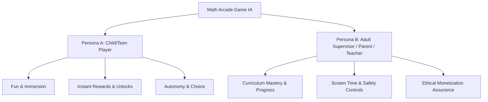

# User & Demographic Psychology Research (`DEMOGRAPHIC_PSYCHOLOGY.md`)

## 1. Executive Summary
This document analyzes the cognitive development milestones, motor skill ergonomics, attention span limits, and dual-user personas (Child Player vs. Adult Supervisor) across five target age brackets (5–15+ years). This psychological foundation directly shapes the Information Architecture, touch target sizing, task flows, and UI density of our mobile math puzzle/arcade game.

---

## 2. Cognitive & Ergonomic Matrix Across Age Tiers

| Age Tier | Cognitive Milestone Stage (Piaget & Modern UX) | Motor Skills & Touch Ergonomics | Attention Span & Session Limits | Preferred Visual & Gameplay Motivators |
| :--- | :--- | :--- | :--- | :--- |
| **Ages 5–7** *(Early Concrete)* | Concrete visual math (counting objects, basic addition/subtraction). Cannot process heavy text prompts. | Developing fine motor skills. **Min Touch Target: 56px – 64px**. Single-tap gestures only. | **3–5 mins per session** (30s per micro-quiz). | Bright, tactile, animal/monster avatars, audio cues, star bursts, zero punishment. |
| **Ages 7–9** *(Middle Concrete)* | Mental arithmetic, multiplication tables, basic pattern matching. Follows 2-step task flows. | Improving accuracy. **Min Touch Target: 48px – 52px**. Supports simple drag-and-drop. | **8–12 mins per session** (1–2 mins per map node). | Island adventure maps, treasure chests, collectible stickers/pets, friendly feedback. |
| **Ages 9–11** *(Late Concrete)* | Multi-step word problems, fractions, division, time estimation. Strategic thinking emerges. | Precise tap control. **Min Touch Target: 44px – 48px**. Supports swipes and keypad entry. | **15–20 mins per session** (3–5 mins per quiz set). | Custom avatars, daily streak rewards, unlockable themes, puzzle trophy rooms. |
| **Ages 11–13** *(Early Abstract)* | Pre-algebra, ratios, spatial logic, negative numbers. Rejects "kiddie" aesthetics. | Adult-equivalent dexterity. **Min Touch Target: 40px – 44px**. High-speed tap input. | **20–25 mins per session** (Flow state). | Neon/cyber/arcade aesthetic, speed challenges, rival leaderboards, power-up boosts. |
| **Ages 13–15+** *(Abstract Logic)* | Algebra, geometry, logic puzzles, rapid mental calculations. High competitive drive. | Maximum precision. **Min Touch Target: 36px – 40px**. Dense keypad layout. | **25–30+ mins per session** (Arcade grind). | Minimalist sleek UI, global rankings, seasonal rank badges, analytics graphs. |

---

## 3. Dual-User Persona Framework

### Persona A: The Player (Child / Teen)
- **Primary Need:** Immediate engagement, satisfying visual feedback, sense of mastery without frustration.
- **IA Impact:** Direct access to `[Play]` button from Home Screen; instant `[Need a Hint?]` AI clue drawer; rewarding `[Rewards Chest]` unlocking screens.

### Persona B: The Supervisor (Parent / Educator)
- **Primary Need:** Verification that the game is educationally valuable, safe, and transparent.
- **IA Impact:** Dedicated `[Parent Dashboard / Teacher Portal]` gated by a simple PIN lock (e.g., "Multiply 7 × 8 to enter"). Contains weekly accuracy charts, time-spent metrics, and COPPA-compliant privacy settings.

---

## 4. Architectural IA Guidelines Derived from Psychology

1. **Adaptive Navigation Density:**
   - **For Ages 5–8:** Max 3 main navigation items on screen (`[Play]`, `[Map]`, `[Rewards]`). Icon-first, text-second.
   - **For Ages 9–15:** Standard 5-tab bottom navigation (`[Home]`, `[Map]`, `[Shop]`, `[Leaderboards]`, `[Profile]`).
2. **Motor Ergonomics:**
   - Place primary action buttons (`[Submit]`, `[Hint]`) within the **Thumb Zone** (lower 40% of mobile screen).
3. **AI Hint Ergonomics:**
   - For 5–7 year olds, hints are presented with visual audio playback and picture clues.
   - For 11–15 year olds, hints are structured as step-by-step formula hints.
