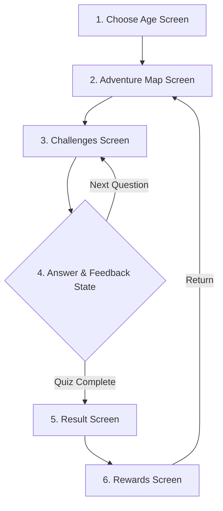

# Information Architecture & Screen Flow Specification (`IA_SPEC.md`)

## 1. Core Screen Sequence Map

The application follows a 6-stage linear and cyclical user navigation architecture designed for clarity, age adaptiveness, and reward-driven engagement.



---

## 2. Screen-by-Screen IA Breakdown

| Screen # | Screen Name | Key UI Components & Metadata | Navigation Actions |
| :--- | :--- | :--- | :--- |
| **Screen 1** | **Choose Age (Onboarding)** | - Age Bracket Cards (`[5-8 Early]`, `[9-13 Mid]`, `[14-20 Pro]`)<br>- Avatar customization preview<br>- Bright, friendly visual theme selector | Selects age bracket $\rightarrow$ Saves profile state $\rightarrow$ Navigates to **Adventure Map**. |
| **Screen 2** | **Adventure Map** | - Pinned Top HUD (`[Coins]`, `[Gems]`, `[Profile]`, `[Settings]`)<br>- Path-based node map with locked/unlocked stages<br>- Level Star indicators (1-3 stars)<br>- Daily Challenge banner | Taps active unlocked node $\rightarrow$ Navigates to **Challenges Screen**. |
| **Screen 3** | **Challenges (Quiz Canvas)** | - Progress bar & Arcade countdown timer<br>- Active Math Question Canvas<br>- Multiple-choice or keypad input<br>- `[💡 Need a Hint?]` AI Button<br>- Top-right `[||]` Pause Menu button | Submits answer $\rightarrow$ Triggers **Answer State**. Taps Hint $\rightarrow$ Opens AI Clue Drawer. |
| **Screen 4** | **Answer & Feedback** | - **State A (Correct ✅):** Green burst, points popup.<br>- **State B (Incorrect ❌):** Red feedback + AI Step-by-Step Explanation (`24 ÷ 6 = 4 because 6 × 4 = 24`). | Taps `[Next Question]` or `[Try Again]`. |
| **Screen 5** | **Result Screen** | - Overall Score & Accuracy Percentage<br>- Time spent per question<br>- Star Rating Earned (⭐⭐⭐)<br>- Breakdown of correct vs. wrong answers | Taps `[Claim Rewards]` $\rightarrow$ Navigates to **Rewards Screen**. |
| **Screen 6** | **Rewards Screen** | - Reward Chest Unlocking Animation<br>- Coins/Gems added animation<br>- Unlocked Character Skins / Power-ups preview<br>- `[Double Rewards (Watch Ad)]` optional button | Taps `[Continue]` $\rightarrow$ Returns to **Adventure Map** with updated progress. |

---

## 3. Structural Sitemap

```
├── 1. Choose Age Screen (Onboarding)
├── 2. Adventure Map (Main Hub)
│   ├── Top HUD (Coins / Gems / Profile)
│   ├── Settings Modal
│   └── Shop / Customization Drawer
├── 3. Challenges Screen (Active Gameplay)
│   ├── In-Game Pause Modal
│   └── AI Hint Drawer
├── 4. Answer & Feedback Drawer
│   └── AI Explanation Box
├── 5. Result Screen (Summary & Performance)
└── 6. Rewards Screen (Chest & Item Unlock)
```
