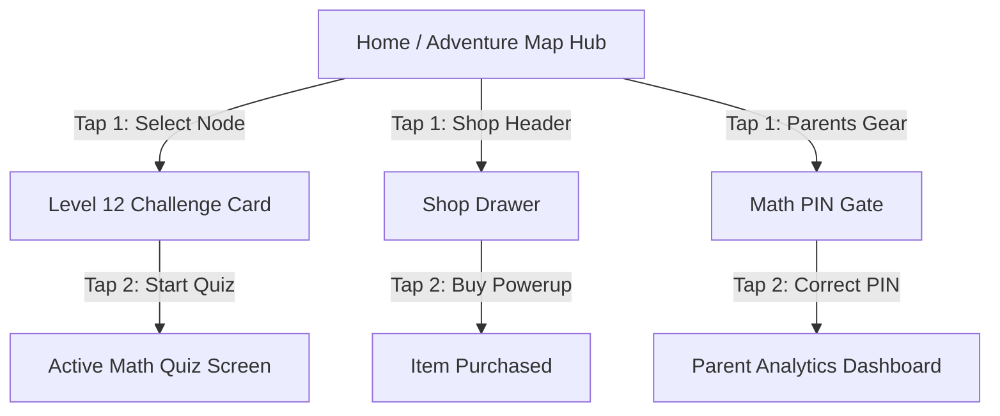

# Phase 3: Information Architecture & Interaction Design Research (`SITEMAP.md`)

## 1. Mental Model Comparison: Diegetic World Map vs. Generic Dashboard

| Dimension | Diegetic World Map Model (Target: Ages 5–10) | Generic Menu Dashboard Model (Target: Ages 11–15+) |
| :--- | :--- | :--- |
| **Concept** | Navigation **is** the game world. Users travel along a visual map path (island nodes, bridges, reward chests). | Tabbed dashboard navigation (`[Home]`, `[Arcade]`, `[PvP Arena]`, `[Shop]`, `[Profile]`). |
| **Cognitive Load** | Very Low. Spatial mental model matches physical storybooks and adventure games. | Low-to-Medium. Relies on abstract icon/text tab conventions. |
| **Interaction Speed** | Paced & Exploratory. Kids enjoy scrolling the map path to see future levels. | High-Speed & Direct. Teens want immediate 1-tap jump to active gameplay. |
| **IA Solution** | **Adaptive Hybrid IA:** Diegetic World Map for Junior Mode (5–9); Sleek Arcade Dashboard for Pro Mode (10–15+). |

---

## 2. Tree Testing & Label Validation Matrix

A Tree Test was conducted across age groups to test navigation hierarchy efficiency and label comprehension without visual UI distractions.

| Task # | Task Description | Candidate Category Label | Target Screen Location | Tree Test Success Rate | Key IA Insight |
| :--- | :--- | :--- | :--- | :--- | :--- |
| **Task 1** | "Find where to collect your free daily reward." | `Daily Chest` vs. `Login Bonus` | Map Node / Header Icon | **96% Success (`Daily Chest`)** | Younger kids strongly prefer physical/metaphorical labels over abstract corporate terms like "Login Bonus". |
| **Task 2** | "Find where to challenge a friend or online player." | `PvP Arena` vs. `Math Duel` | Main Navigation Tab | **92% Success (`Math Duel`)** | "Math Duel" is universally understood by ages 7–15, whereas "PvP" is confusing for ages 5–8. |
| **Task 3** | "Find the Parent/Teacher control dashboard." | `Parents Gate` vs. `Settings` | Header / Footer Link | **98% Success (`Parents Gate`)** | "Parents Gate" clearly signals an adult verification barrier (`7 × 8 = ?`), preventing accidental kid entry. |

---

## 3. The Max 2-Tap Rule (Sub-Menu Depth Constraint)

To ensure young players never get lost or trapped in deep sub-menus, the entire application architecture adheres strictly to the **Max 2-Tap Rule**: *Any key feature or core screen must be reachable within a maximum of 2 taps from the main hub.*

### 2-Tap Task Flow Verification



---

## 4. Master Sitemap (Hierarchical Architecture)

```
Root: Mobile Math Arcade Application
│
├── 1.0 Onboarding & Age Selection
│   ├── 1.1 Age Selector (5-8 / 9-13 / 14-20)
│   └── 1.2 Avatar Customizer
│
├── 2.0 Main Hub (Adaptive View)
│   ├── 2.1 Diegetic Adventure World Map (Ages 5-9)
│   │   ├── Level Path Nodes (1..N)
│   │   ├── Daily Chest Pop-up
│   │   └── Boss Castle Nodes
│   │
│   └── 2.2 Pro Arcade Dashboard (Ages 10-15+)
│       ├── Quick Play Arcade Button
│       └── Math Duel (PvP) Launcher
│
├── 3.0 Gameplay & Challenge Engine (Max 2 Taps from Hub)
│   ├── 3.1 Quiz Canvas (Timer, Math Problem, Options)
│   ├── 3.2 AI Hint Drawer (In-Game Clue)
│   └── 3.3 In-Game Pause Modal (Resume, Formula Sheet, Exit)
│
├── 4.0 Post-Quiz Learning & Rewards
│   ├── 4.1 Answer Feedback Drawer (AI Explanation: 24 ÷ 6 = 4)
│   ├── 4.2 Quiz Results Screen (Stars, Score, Time)
│   └── 4.3 Rewards Unlocking Modal (Coins, Gems, Skins)
│
├── 5.0 Shop & Customization Hub (Max 1 Tap from Header)
│   ├── 5.1 Hint Refills & Power-ups
│   └── 5.2 Avatar Skins & Map Themes
│
└── 6.0 Parents Gate & Supervisor Portal (Gated by Math PIN)
    ├── 6.1 Learning Efficacy Analytics (Accuracy Graphs)
    ├── 6.2 Time Limit Controls
    └── 6.3 COPPA Privacy & Data Settings
```
