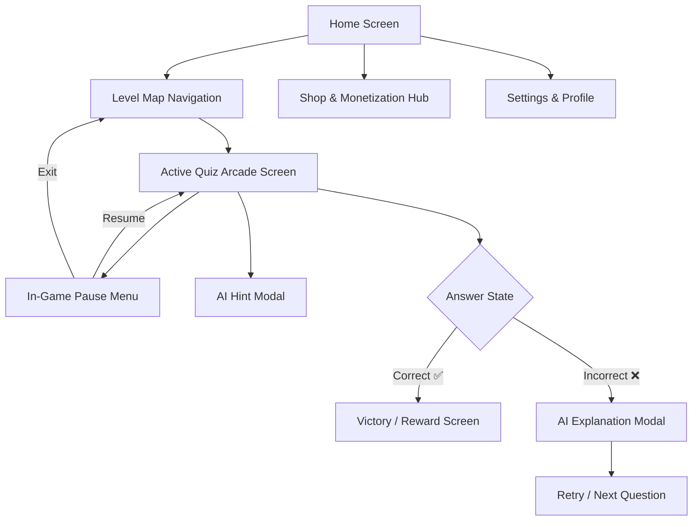

# Phase 1: Research & Information Architecture Objectives

## 1. Project Overview & Vision
- **Project Name:** Math Arcade & Puzzle Quiz (Working Title)
- **Domain:** Mobile Educational Arcade / Puzzle Game
- **Target Audience:** Ages 5–20 (Tiered: Junior 5–9, Intermediate 10–14, Advanced Arcade 15–20)
- **Core Objective:** Conduct an Information Architecture (IA) research and structural comparison for a mobile math game, focusing on intuitive navigation, age-tailored layout hierarchy, non-intrusive monetization, and AI-assisted learning loops.

---

## 2. Technical Feasibility & Reality Check: AI Assistance Engine

### Proposed Features
1. **In-Quiz AI Clue System ("Need a Hint?"):** Triggers a micro-clue without revealing the exact numerical answer.
2. **Post-Answer AI Explanation:** Triggers on incorrect answers (❌) with step-by-step math breakdowns (e.g., `24 ÷ 6 = 4 because 6 × 4 = 24`).

### Architectural Implementation Strategies

| Criterion | Strategy A: Rule-Based Template Engine (Recommended for IA Spec) | Strategy B: LLM API Integration (Gemini / OpenAI API) |
| :--- | :--- | :--- |
| **Mechanism** | Pre-structured math logic templates based on inverse operations and grade-level rules. | Real-time call to lightweight LLM (e.g., Gemini 1.5 Flash / GPT-4o-mini). |
| **Response Time** | Instant (< 10ms), zero lag. | 500ms – 1.5s (requires loading state spinner). |
| **Cost & Reliability** | 100% Free, 100% Offline, zero API downtime. | Pay-per-token API cost, requires internet connection. |
| **Age Safety** | Fully controlled, kid-safe, guaranteed no hallucination. | Requires strict system prompt guardrails for kid safety. |
| **IA Impact** | Pinned `[Hint]` icon on HUD; immediate inline modal. | Pinned `[AI Assistant]` icon with animated typing indicator modal. |

---

## 3. Core Screen Architecture & Touchpoint Taxonomy

---

## 4. Key Navigation Touchpoints

### A. Home Screen & Persistent Header HUD
- **Header (Top Bar):** Player Avatar, Level/XP Bar, Star/Coin Counter (Monetization entry point), Settings Gear.
- **Main Viewport:** Quick Play Button, Game Mode Selection (Arcade vs. Puzzle), Age League Selector.
- **Footer Navigation Bar:** `[Home]`, `[Level Map]`, `[Shop]`, `[Leaderboard]`, `[Achievements]`.

### B. Level Map Navigation
- **Visual Structure:** Path-based node map (island/world progression for ages 5-12) or Grid/Stage selection (ages 13-20).
- **Node Metadata:** Star Rating (1-3 stars), Difficulty Indicator, Lock Status, Bonus Gem Reward flag.

### C. Pause Menu Modal
- **Trigger:** Top-right `[||]` icon on Active Quiz Screen.
- **Contained IA Elements:**
  - Game Resume Button
  - Quiz Restart Button
  - Sound & SFX Volume Sliders
  - Quick Math Formula Cheat Sheet
  - Exit Level to Map (with confirmation dialog)

### D. Shop & Monetization Entry Points
- **Entry Point 1:** Top Header Coin/Gem counter (Persistent across Home and Level Map).
- **Entry Point 2:** Post-Level Victory Screen ("Double your rewards" or "Buy Power-Ups").
- **Entry Point 3:** Out-of-Lives Modal during quiz gameplay.

### E. AI Hint & Explanation Modals
- **In-Game Hint Button:** Located on the active problem canvas (`[💡 Need a Hint?]`). Cost: 1 Hint Credit or Free with cooldown.
- **Post-Answer Feedback Banner:** Slides up on incorrect answer. Displays:
  - Error Notification: `❌ Incorrect`
  - AI Step-by-Step Breakdown: `24 ÷ 6 = 4 because 6 × 4 = 24`
  - Action Button: `[Try Again]` or `[Next Problem]`
